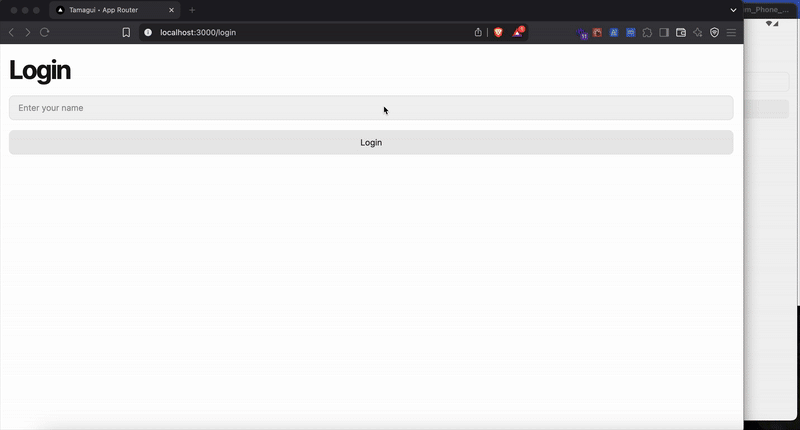

TamGUI Slideshow

A slideshow application built with TamGUI that handles authentication and persistence seamlessly.

Features:

User authentication support

Persistent state management

Cross-platform: Web and Mobile support

Installation:
Make sure you have Yarn installed.

Run:
yarn install

Usage:

For Web:
Run:
yarn web

For Mobile (Native):
Run:
yarn native

Demo:

